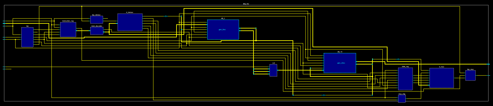
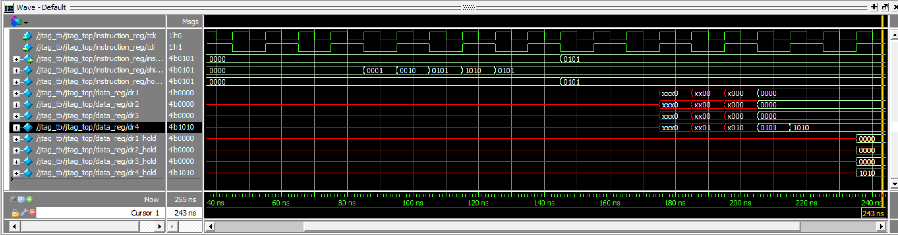

# Custom-JTAG-TAP-Controller (IEEE STD 1149.1)

## JTAG ARCHITECTURE

## Simulation of USER DATA REGISTER instruction.
JTAG controller used to load an instruction associated with user data register 4 and then load data in the same register.
